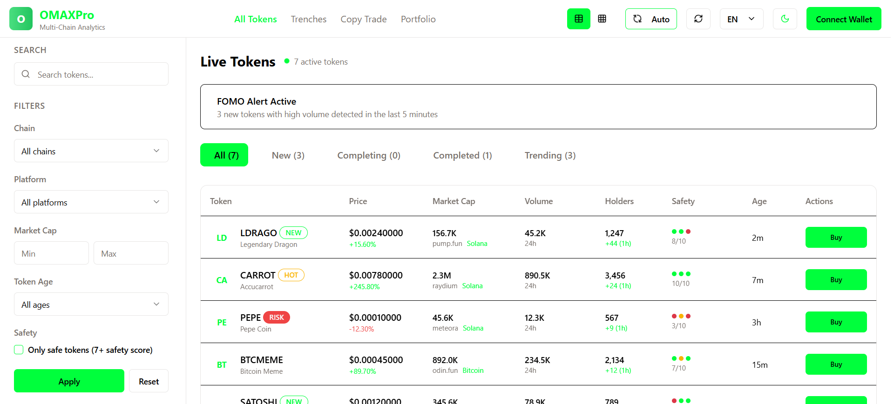

# 🧠 OMAXPro – Onchain Multichain Trading Platform


Welcome to **OMAXPro**, a fully decentralized multichain trading platform built on the **Internet Computer Protocol (ICP)** using its revolutionary **Chain Fusion** technology.

OMAXPro allows users to trade assets natively across **Bitcoin (odin.fun)**, **Solana (Raydium, pump.fun)**, and **Ethereum (Uniswap)**—all from a single interface. Users sign in with **Bitcoin**, **Solana**, or **Ethereum** addresses and manage their assets using one unified wallet, generated and secured onchain via **chain-key cryptography**.

---

## 🚀 Key Features

- 🔄 Native multichain trading: Bitcoin, Ethereum, and Solana
- 🔐 Unified onchain wallet via chain-key cryptography
- 🖥 Fully decentralized frontend hosted on ICP
- 🛠 Canister-based orchestration with real-time RPC to external chains
- 🤖 Future support for programmable onchain trading agents

---

## 🧱 Architecture Overview

OMAXPro is composed of several smart canisters that coordinate wallet generation, trade execution, external chain access, and later AI agent logic:

### 🔧 Wallet Manager Canister
- Creates and manages BTC, ETH, and SOL addresses
- Single sign-in experience using any supported chain
- Onchain identity and unified balance tracking

### 🔄 Trading Engine Canister
- Executes and orchestrates trades across chains
- Reads onchain market data via RPC
- Sends signed transactions to Bitcoin, Ethereum, and Solana networks

### 🔐 Chain Fusion Capabilities
| Chain     | Mechanism                  | Features                              |
|-----------|----------------------------|----------------------------------------|
| Bitcoin   | Bitcoin adapter (native)   | UTXO, address generation, send tx      |
| Ethereum  | EVM RPC canister           | Call contracts, parse logs, sign txs   |
| Solana    | Solana RPC + EdDSA signing | Read accounts, interact with programs  |

### 🖥 Frontend Canister
- React-based interface, served onchain
- Proxy-based development flow (Vite → DFX)
- Uses `@dfinity/agent` for backend interaction

### 🤖 Onchain Agents (later)
- Programmable logic bots stored and run inside canisters
- Monitor real-time onchain events
- Execute decentralized strategies like arbitrage or DCA

---

## 🧪 Local Development Guide

OMAXPro is initialized using the Internet Computer SDK (`dfx`) with full support for frontend and backend development.

### 📦 Prerequisites

- [DFX SDK](https://internetcomputer.org/docs/current/developer-docs/setup/install)
- Node.js & npm

### 📁 Project Structure

```bash
multi-trader/ (OMAXPro root)
├── src/
│   ├── multi-trader-backend/       # Canister logic (Motoko or Rust)
│   ├── multi-trader-frontend/      # Web frontend (React + Vite)
│  
├── dfx.json                   # DFX config
├── package.json               # NPM metadata
└── README.md                  # You're here!


If you want to start working on your project right away, you might want to try the following commands:

```bash
cd multi-trader/
dfx help
dfx canister --help
```

## Running the project locally

If you want to test your project locally, you can use the following commands:

```bash
# Starts the replica, running in the background
dfx start --background

# Deploys your canisters to the replica and generates your candid interface
dfx deploy
```

Once the job completes, your application will be available at `http://localhost:4943?canisterId={asset_canister_id}`.

If you have made changes to your backend canister, you can generate a new candid interface with

```bash
npm run generate
```

at any time. This is recommended before starting the frontend development server, and will be run automatically any time you run `dfx deploy`.

If you are making frontend changes, you can start a development server with

```bash
npm start
```

Which will start a server at `http://localhost:8080`, proxying API requests to the replica at port 4943.

### Note on frontend environment variables

If you are hosting frontend code somewhere without using DFX, you may need to make one of the following adjustments to ensure your project does not fetch the root key in production:

- set`DFX_NETWORK` to `ic` if you are using Webpack
- use your own preferred method to replace `process.env.DFX_NETWORK` in the autogenerated declarations
  - Setting `canisters -> {asset_canister_id} -> declarations -> env_override to a string` in `dfx.json` will replace `process.env.DFX_NETWORK` with the string in the autogenerated declarations
- Write your own `createActor` constructor


## 📄 License

This project is licensed under the **Creative Commons Attribution-NonCommercial 4.0 International (CC BY-NC 4.0)** License.

See the full license: [CC BY-NC 4.0](https://creativecommons.org/licenses/by-nc/4.0/)
